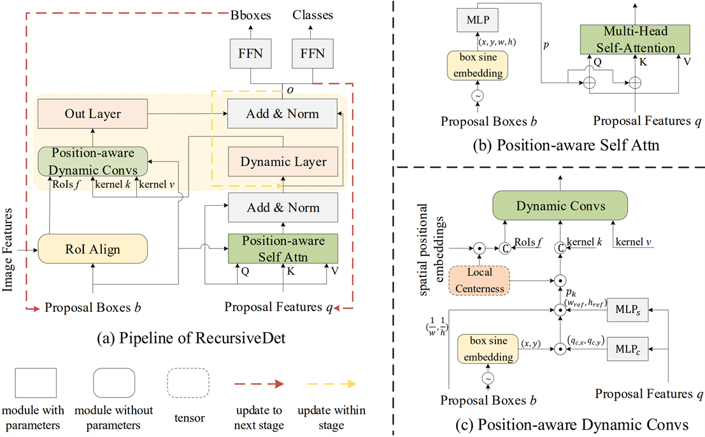

# RecursiveDet
This is the official implementation of the paper "[RecursiveDet: End-to-End Region-based Recursive Object Detection](https://arxiv.org/abs/2209.10391)"

[](https://openaccess.thecvf.com/content/ICCV2023/html/Zhao_RecursiveDet_End-to-End_Region-Based_Recursive_Object_Detection_ICCV_2023_paper.html)
[](https://arxiv.org/abs/2307.13619) [](https://youtu.be/zB28DyL3ImE)

## Methods
<p align="center">

<br>
</p>

This paper investigates the region-based object detectors. 
1. Recursive structure for decoder:

   a) We share the decoder parameters among different stages, which significantly reduces the model size.
   
   b) A short recusion loop is made to increase the depth of model.
3. Positional Encoding:

   a) We design bounding box PE into region-based detectors.

   b) Centerness-based PE is proposed to distinguish the RoI feature element and dynamic kernels at different positions within the bounding box.

### The codes are released.

## Installation
The codebases are built on top of [Detectron2](https://github.com/facebookresearch/detectron2) and [SparseR-CNN](https://github.com/PeizeSun/SparseR-CNN).

#### Requirements
- Linux or macOS with Python ≥ 3.6
- PyTorch ≥ 1.5 and [torchvision](https://github.com/pytorch/vision/) that matches the PyTorch installation.
  You can install them together at [pytorch.org](https://pytorch.org) to make sure of this
- OpenCV is optional and needed by demo and visualization

#### Steps
1. Install and build libs
```
git clone https://github.com/bravezzzzzz/RecursiveDet.git
cd RecursiveDet
python setup.py build develop
```

2. Link coco dataset path to RecursiveDet/datasets/coco
```
mkdir -p datasets/coco
ln -s /path_to_coco_dataset/annotations datasets/coco/annotations
ln -s /path_to_coco_dataset/train2017 datasets/coco/train2017
ln -s /path_to_coco_dataset/val2017 datasets/coco/val2017
```

3. Train
```
python projects/SparseRCNN/train_net.py --num-gpus 8 \
    --config-file projects/SparseRCNN/configs/sparsercnn.res50.100pro.3x.yaml
```

4. Evaluate
```
python projects/SparseRCNN/train_net.py --num-gpus 8 \
    --config-file projects/SparseRCNN/configs/sparsercnn.res50.100pro.3x.yaml \
    --eval-only MODEL.WEIGHTS path/to/model.pth
```

5. Visualize
```    
python demo/demo.py\
    --config-file projects/SparseRCNN/configs/sparsercnn.res50.100pro.3x.yaml \
    --input path/to/images --output path/to/save_images --confidence-threshold 0.4 \
    --opts MODEL.WEIGHTS path/to/model.pth
```

## Citing

If you use this code for your research, please cite

```BibTeX

@article{zhao2023recursivedet,
  title={RecursiveDet: End-to-End Region-based Recursive Object Detection},
  author={Zhao, Jing and Sun, Li and Li, Qingli},
  journal={arXiv preprint arXiv:2307.13619},
  year={2023}
}

```
